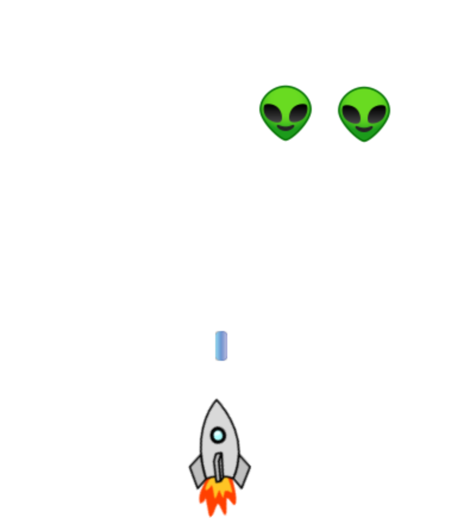
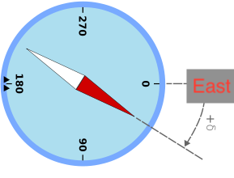
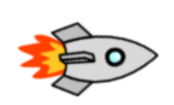

## Understanding Actors 
Actors are the basic building blocks with Greenfoot. Every visual object that you see on a screen is a type of Actor.  Imagine the following simplified Space Invaders game.

We have 4 Actors above. One Rocket (Actor), one Bullet (Actor) and 2 Alien (Actor). You will learn how to create your own Actors later during the course.

If we think of a compass, East usually maps to 90°. (North at 0°) However, (for whatever reason) the developers of Greenfoot decided that East would be 0°. So you now have to think of the compass positions as such.

East being at 0°, South at 90°, West at 180° and North at 270°. 

Actors have an attribute called *rotation* that contains any value between 0 and 359 which decides which way they are "facing". When actors are initially created they are always facing east. This means that they have a rotation of 0°. This is important to know, because when we instruct and actor to *move*, they always move in the direction they are facing. Let's understand what this means with an example. Assume that we have a Rocket that currently is facing east, or in other words, has a rotation of 0°. The rocket would look like this on the screen.

If we were to "Tell" the rocket the following sequence of commands - please note that everything with a *//* is just a comment for you to understand what each line is doing.  
[source, java]
----
    move(5);            // move 5 pixels toward east
    setRotation(270);   // makes the rocket now face north 
    move(5);            // move 5 pixels toward north
    setRotation(180);   // makes the rocket now face west 
    move(5);            // move 5 pixels toward west
    setRotation(90);    // makes the rocket now face south 
    move(5);            // move 5 pixels toward south
    setRotation(0);     // makes the rocket now face east again - like it started
----

The rocket would have traced out a square and would be back at the same position as it started.

All Actors inherit some very useful behaviour. More will be discussed in class

